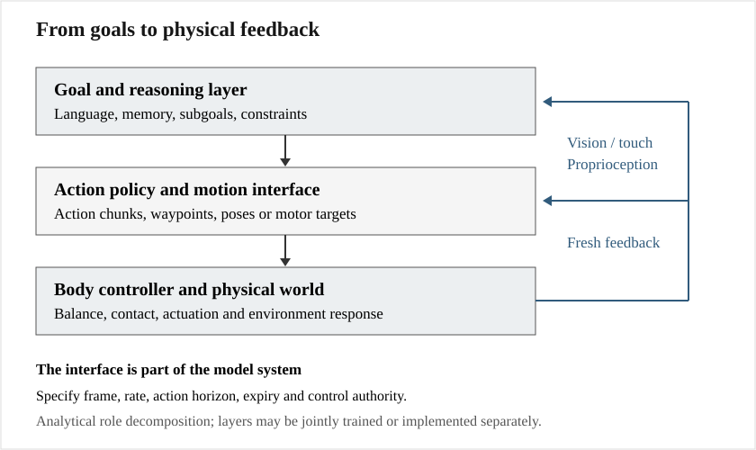

# Embodied Intelligence Models: Progress, Mechanisms, and Relationships

[中文](README.md) · Evidence checked through **September 11, 2026**

A comprehensive technical scoping review of manipulation, VLAs, world models, planning, navigation, and whole-body control. **77 model/version/method cards, 80 relationships, 155 deduplicated sources, and product evidence for 11 organizations.** Cards include versions and components, not that many independent foundation models.

- **[Full English report](records/artifacts/survey-report-en.md)** · [English PDF](reports/embodied-intelligence-model-survey-en.pdf)
- **[Chinese report](records/artifacts/survey-report.md)** · [Chinese PDF](reports/embodied-intelligence-model-survey.pdf)
- [Model Atlas](records/artifacts/model-atlas.md) · [Model matrix](records/artifacts/model-matrix.csv)
- [Relationship analysis](records/artifacts/model-relations.md) · [Graph data](records/artifacts/relationship-graph.json)
- [Data](records/artifacts/data-matrix.csv) · [Benchmarks](records/artifacts/benchmark-matrix.csv) · [Products](records/artifacts/product-matrix.csv)
- [Evaluation plan](records/artifacts/evaluation-plan.md) · [Source ledger](records/artifacts/sources.json) · [BibTeX](records/artifacts/references.bib)
- [Coverage](records/views/coverage-map.md) · [Evidence audit](records/views/evidence-audit.md) · [All files](CONTENTS.md)



Each model is decomposed into its problem, inputs, architecture, action representation, objective, data, execution, contribution, and limitations. Relationships distinguish explicit reuse, series evolution, method combinations, and analytical complementarity. An arrow does not automatically mean weight inheritance, and a newer release does not establish superiority across every task.

The scope connects ACT/DP, RT/RT-X, Octo, OpenVLA/OFT, PI, GR00T, Gemini Robotics, compact and cross-embodiment VLAs, geometric policies, latent/video world models, navigation, humanoid controllers, and deployed product systems. Five challenges concern transferable actions/contact, persistent memory/recovery, decision-useful world models, latency/energy/control, and auditable continual improvement.

## Structure and reproduction

`intent/` defines the scope and protocol; `records/research/` retains source modules; `records/artifacts/` contains reports and catalogs; `records/views/` records evidence and coverage; `records/runs/` contains search and validation records. Editable diagrams, PDFs, and build scripts live in `figures/`, `reports/`, and `scripts/`.

With Python 3.10+ and dependencies installed:

```bash
python scripts/assemble.py
python scripts/build_reports.py
python scripts/validate.py
python scripts/build_manifest.py
python scripts/check_manifest.py
```

PDF generation requires a Chinese-capable TrueType font; macOS Arial Unicode is detected by default, with a script option for other systems. Inspect pagination, figures, and glyphs after changes, then refresh the manifest. Edit the source modules rather than generated report files.

This repository contains literature analysis and a proposed evaluation design, not reproduced robot experiments. Different benchmark protocols are not combined into an overall ranking. Vendor demonstrations, customer pilots, delivery plans, and sustained operation remain separate evidence categories. No exhaustive recall claim is made. Original papers, code, weights, data, and their licenses belong to their owners. See [ATTRIBUTION](ATTRIBUTION.md).
