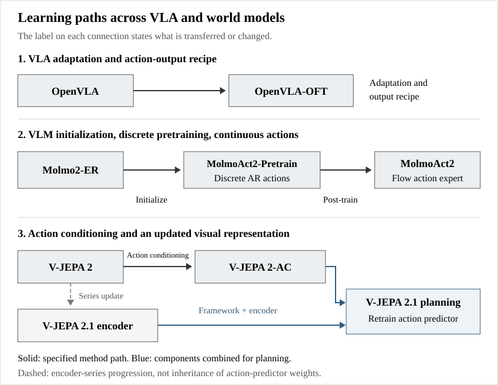
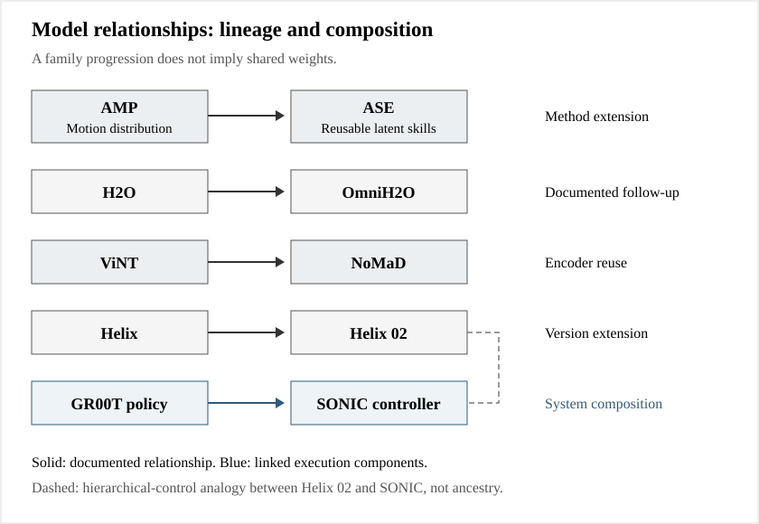

# Model relationships / 模型关系

Explicit means the relationship is documented, not necessarily that weights are inherited. Analytical means a comparison or complementary design inference. Read each edge type and explanation. Component/version reference nodes supplement grouped catalog cards. GEN-1/1.5 and several named subcomponents are discussed in the reports and represented as context nodes, without separate full catalog cards.

| From | To | Type | Evidence | Explanation | Sources |
|---|---|---|---|---|---|
| ACT | Diffusion Policy | shared_design_axis | analytical | Both predict action sequences to manage the control horizon, but CVAE chunking and diffusion are different policy distributions, not successive checkpoints. | [S001](https://arxiv.org/abs/2304.13705), [S003](https://arxiv.org/abs/2303.04137) |
| Diffusion Policy | Octo | policy_family | explicit | Octo describes itself as a transformer-based diffusion policy scaled through diverse robot pretraining. | [S003](https://arxiv.org/abs/2303.04137), [S011](https://arxiv.org/abs/2405.12213), [S012](https://github.com/octo-models/octo) |
| RT-1 | RT-2 | research_successor | explicit | RT-2 succeeds RT-1 in the same research line but changes to a pretrained VLM and text-form actions; this is not RT-1 weight continuation. | [S006](https://robotics-transformer1.github.io/), [S008](https://robotics-transformer2.github.io/) |
| RT-1 | RT-X policies (RT-1-X / RT-2-X) | architecture_reuse | explicit | RT-1-X applies the RT-1 architecture to cross-embodiment data. | [S009](https://arxiv.org/abs/2310.08864), [S010](https://github.com/google-deepmind/open_x_embodiment) |
| RT-2 | RT-X policies (RT-1-X / RT-2-X) | architecture_reuse | explicit | RT-2-X is the VLM-based RT-X instantiation. | [S009](https://arxiv.org/abs/2310.08864), [S010](https://github.com/google-deepmind/open_x_embodiment) |
| Open X-Embodiment dataset | Octo | data_infrastructure | explicit | Octo pretraining uses the Open X-Embodiment dataset; RT-X weights are not the Octo backbone. | [S009](https://arxiv.org/abs/2310.08864), [S011](https://arxiv.org/abs/2405.12213) |
| Open X-Embodiment dataset | OpenVLA | data_infrastructure | explicit | OpenVLA uses the Open X-Embodiment data ecosystem while choosing its own VLM architecture. | [S009](https://arxiv.org/abs/2310.08864), [S013](https://arxiv.org/abs/2406.09246) |
| RT-2 | OpenVLA | shared_design_axis | analytical | Both map VLM features to discretized autoregressive actions; similarity is architectural, not proof of inherited private RT-2 weights. | [S007](https://arxiv.org/abs/2307.15818), [S013](https://arxiv.org/abs/2406.09246) |
| OpenVLA | OpenVLA-OFT | checkpoint_and_recipe_adaptation | explicit | OFT modifies OpenVLA fine-tuning and action decoding while retaining its pretrained foundation. | [S015](https://arxiv.org/abs/2502.19645), [S016](https://openvla-oft.github.io/) |
| pi0 | pi0-FAST | variant | explicit | pi0-FAST uses FAST tokenization to instantiate an autoregressive variant; FAST itself is a representation method. | [S019](https://www.pi.website/research/fast), [S020](https://github.com/Physical-Intelligence/openpi) |
| pi0 | pi0.5 / knowledge insulation | model_successor | explicit | pi0.5 builds on pi0 and adds heterogeneous training and hierarchical task behavior. | [S021](https://www.pi.website/download/pi05.pdf) |
| FAST action tokenizer | pi0.5 / knowledge insulation | training_representation | explicit | Knowledge insulation uses FAST action tokens as an auxiliary learning signal for the VLM backbone. | [S022](https://www.pi.website/research/knowledge_insulation) |
| pi0.5 / knowledge insulation | pi0.6 | model_successor | explicit | The pi0.6 model card explicitly builds on pi0.5 while changing backbone, action expert and data. | [S023](https://website.pi-asset.com/pi06star/PI06_model_card.pdf) |
| pi0.6 | pi-star-0.6 / RECAP | reinforcement_post_training | explicit | RECAP trains pi0.6 with offline and on-robot RL, yielding pi-star-0.6. | [S024](https://www.pi.website/blog/pistar06), [S025](https://www.pi.website/download/pistar06.pdf) |
| pi0.6 | MEM / pi0.6-MEM | memory_extension | explicit | The memory experiments augment pi0.6 with visual and language memory. | [S028](https://www.pi.website/research/memory) |
| pi0.6 | pi0.7 | architecture_inheritance | explicit | pi0.7 retains the pi0.6 architectural foundation and changes context conditioning. | [S026](https://www.pi.website/download/pi07.pdf) |
| MEM / pi0.6-MEM | pi0.7 | module_inheritance | explicit | pi0.7 uses the MEM-style visual-history encoder and memory system. | [S026](https://www.pi.website/download/pi07.pdf), [S028](https://www.pi.website/research/memory) |
| pi-star-0.6 / RECAP | pi0.7 | experience_distillation | explicit | pi0.7 uses experience from RL-trained specialists with strategy metadata to absorb their behaviors. | [S026](https://www.pi.website/download/pi07.pdf), [S027](https://www.pi.website/blog/pi07) |
| pi0 | GR00T N1 | shared_design_axis | analytical | Both couple VLM features to flow action generation, but GR00T uses cross-attention and embodiment adapters; they do not share published checkpoints. | [S017](https://www.pi.website/download/pi0.pdf), [S031](https://arxiv.org/abs/2503.14734) |
| ACT | GR00T N1 | cited_design | explicit | The GR00T N1 paper explicitly cites ACT for action chunking. | [S031](https://arxiv.org/abs/2503.14734) |
| GR00T N1 | GR00T N1.5 | model_successor | explicit | N1.5 modifies the VLM, data and future-feature objective relative to N1. | [S032](https://research.nvidia.com/labs/gear/gr00t-n1_5/) |
| GR00T N1.5 | GR00T N1.6 | model_successor | explicit | N1.6 replaces/updates the backbone, enlarges the DiT and changes action representations. | [S033](https://research.nvidia.com/labs/gear/gr00t-n1_6/) |
| GR00T N1.6 | GR00T N1.7 | model_successor | explicit | The repository positions N1.7 as the next N1 release, with a new Cosmos-Reason2 backbone and deployment support. | [S034](https://developer.nvidia.com/blog/develop-humanoid-robot-policies-end-to-end-with-nvidia-isaac-gr00t/), [S035](https://github.com/NVIDIA/Isaac-GR00T) |
| Gemini Robotics (VLA) | Gemini Robotics 1.5 (VLA) | model_successor | explicit | The 1.5 report extends the Gemini Robotics line through motion transfer and reasoning/action interleaving. | [S038](https://arxiv.org/abs/2510.03342) |
| Gemini Robotics 1.5 (VLA) | Gemini Robotics 2 (VLA) | model_successor | explicit | Robotics 2 extends the earlier upper-body focus into whole-body control. | [S042](https://deepmind.google/blog/gemini-robotics-2-brings-whole-body-intelligence-to-robots/) |
| Gemini Robotics-ER 1.5 | Gemini Robotics-ER 1.6 | reasoning_branch_successor | explicit | ER 1.6 follows ER 1.5 within the reasoning branch; it does not replace the VLA action decoder. | [S040](https://deepmind.google/models/model-cards/gemini-robotics-er-1-6/), [S041](https://deepmind.google/blog/gemini-robotics-er-1-6/) |
| Gemini Robotics-ER 1.6 | Gemini Robotics-ER 2 | reasoning_branch_successor | explicit | ER 2 is the later embodied reasoning model in the same family, now based on Gemini 3.5 Flash. | [S042](https://deepmind.google/blog/gemini-robotics-2-brings-whole-body-intelligence-to-robots/), [S043](https://deepmind.google/models/model-cards/gemini-robotics-er-2/) |
| Gemini Robotics-ER 2 | Gemini Robotics 2 (VLA) | system_composition | explicit | ER 2 supplies planning and coordination while Robotics 2 produces executable robot behavior. | [S042](https://deepmind.google/blog/gemini-robotics-2-brings-whole-body-intelligence-to-robots/) |
| Gemini Robotics 1.5 (VLA) | Gemini Robotics On-Device 2 | technology_inheritance | explicit | The On-Device 2 model card explicitly names Robotics 1.5 technology and on-device Gemma as its basis. | [S044](https://deepmind.google/models/model-cards/gemini-robotics-on-device-2/) |
| Diffusion Policy | RDT-1B | shared_design_axis | analytical | RDT scales continuous generative action modeling and adds unified physical action semantics; comparison is methodological, not weight inheritance. | [S003](https://arxiv.org/abs/2303.04137), [S045](https://arxiv.org/abs/2410.07864) |
| OpenVLA | UniVLA (OpenDriveLab) | implementation_acknowledgment | explicit | OpenDriveLab UniVLA explicitly acknowledges OpenVLA code; its defining change is learning task-centric latent actions from video. | [S047](https://arxiv.org/abs/2505.06111), [S048](https://github.com/OpenDriveLab/UniVLA) |
| UniVLA (OpenDriveLab) | UniVLA (BAAI) | name_disambiguation | explicit | Two independently authored UniVLA papers have different arXiv IDs, repositories, architectures and objectives. | [S047](https://arxiv.org/abs/2505.06111), [S048](https://github.com/OpenDriveLab/UniVLA), [S049](https://arxiv.org/abs/2506.19850), [S050](https://github.com/baaivision/UniVLA) |
| RDT-1B | LingBot-VLA 2.0 | shared_design_axis | analytical | Both need canonical physical action mappings across embodiments; no direct RDT checkpoint inheritance is claimed. | [S045](https://arxiv.org/abs/2410.07864), [S053](https://arxiv.org/abs/2607.06403), [S054](https://github.com/Robbyant/lingbot-vla-v2) |
| X-VLA | GR00T N1.7 | shared_design_axis | analytical | Soft prompts and embodiment adapters are alternative ways to separate shared representations from hardware-specific interfaces. | [S031](https://arxiv.org/abs/2503.14734), [S034](https://developer.nvidia.com/blog/develop-humanoid-robot-policies-end-to-end-with-nvidia-isaac-gr00t/), [S051](https://arxiv.org/abs/2510.10274) |
| Real-Time Chunking (RTC) | pi0 | execution_layer | explicit | RTC is introduced for action-chunking flow policies and addresses latency without replacing semantic pretraining. | [S055](https://arxiv.org/abs/2506.07339) |
| Real-Time Chunking (RTC) | GR00T N1.6 | execution_integration | explicit | N1.6 reports using real-time chunking during asynchronous robot rollouts. | [S033](https://research.nvidia.com/labs/gear/gr00t-n1_6/) |
| SayCan | PaLM-E | conceptual_comparison | analytical | Observation-conditioned planning extends grounding beyond language relevance and affordance scoring; no weight inheritance asserted. | [S056](https://say-can.github.io/), [S057](https://palm-e.github.io/) |
| SayCan | VoxPoser | interface_alternative | analytical | Fixed skill selection versus geometry-grounded waypoint synthesis. | [S056](https://say-can.github.io/), [S060](https://voxposer.github.io/) |
| PaLM-E | EmbodiedGPT | conceptual_comparison | analytical | Both connect multimodal reasoning to low-level execution through explicit intermediate interfaces. | [S057](https://palm-e.github.io/), [S059](https://arxiv.org/abs/2305.15021) |
| VIMA | PaLM-E | interface_comparison | analytical | Multimodal motor policy versus multimodal textual planner. | [S057](https://palm-e.github.io/), [S058](https://vimalabs.github.io/) |
| R3M | VC-1 | representation_comparison | analytical | Contrastive temporal alignment versus MAE-based broad sensorimotor evaluation; no direct weight reuse claimed. | [S061](https://arxiv.org/abs/2203.12601), [S062](https://arxiv.org/abs/2303.18240) |
| PerAct | RVT | explicit_comparison | explicit | RVT directly addresses explicit 3D compute cost and compares against PerAct. | [S064](https://arxiv.org/abs/2306.14896) |
| PerAct | 3D Diffuser Actor | action_representation_alternative | analytical | Discrete voxel/keypose classification versus continuous geometric action diffusion. | [S063](https://peract.github.io/), [S065](https://3d-diffuser-actor.github.io/) |
| RVT | 3D Diffuser Actor | geometric_policy_comparison | analytical | Both exploit 3D scene structure; action parameterization and attention differ. | [S064](https://arxiv.org/abs/2306.14896), [S065](https://3d-diffuser-actor.github.io/) |
| GR-1 | GR-2 | family_extension | explicit | GR-2 scales generative video pretraining and joint video-action modeling in the GR family. | [S075](https://arxiv.org/abs/2312.13139), [S077](https://arxiv.org/abs/2410.06158), [S091](https://arxiv.org/html/2410.06158v1) |
| V-JEPA 2 | V-JEPA 2-AC | post_training | explicit | Action-conditioned predictor is post-trained using robot trajectories on V-JEPA 2 features. | [S078](https://arxiv.org/abs/2506.09985), [S081](https://github.com/facebookresearch/vjepa2) |
| V-JEPA 2 | V-JEPA 2.1 | training_recipe_extension | explicit | 2.1 adds dense/deep supervision and joint image/video scaling. | [S080](https://arxiv.org/html/2603.14482v1), [S081](https://github.com/facebookresearch/vjepa2) |
| V-JEPA 2-AC | V-JEPA 2.1 | planning_framework_reuse | explicit | V-JEPA 2.1 robot experiments reuse 2-AC predictor architecture, public code and planning protocol, but retrain the action-conditioned predictor on DROID with the new encoder; no inherited predictor weights are claimed. | [S080](https://arxiv.org/html/2603.14482v1) |
| Genie | Genie 2 | family_extension | explicit | Official Genie series progression; exact weight inheritance not stated. | [S071](https://arxiv.org/abs/2402.15391), [S072](https://deepmind.google/blog/genie-2-a-large-scale-foundation-world-model/) |
| Genie 2 | Genie 3 | family_extension | explicit | Official next-generation interactive environment model; architecture reuse not asserted. | [S072](https://deepmind.google/blog/genie-2-a-large-scale-foundation-world-model/), [S073](https://deepmind.google/blog/genie-3-a-new-frontier-for-world-models/) |
| UniSim | DreamerV3 | role_comparison | analytical | Both support policy learning from imagined experience; video simulation and compact reward-driven latent RL have different interfaces. | [S067](https://arxiv.org/html/2301.04104v2), [S070](https://arxiv.org/html/2310.06114v2) |
| GR-1 | Cosmos Policy | joint_prediction_comparison | analytical | Both couple future observations and actions; Cosmos Policy additionally models values for optional search. | [S075](https://arxiv.org/abs/2312.13139), [S083](https://arxiv.org/html/2601.16163v1) |
| Cosmos Policy | Cosmos 3 | convergent_capabilities | analytical | Both unify prediction and action; Cosmos 3 is a different reasoner/generator architecture, not established as a Policy checkpoint successor. | [S083](https://arxiv.org/html/2601.16163v1), [S084](https://developer.nvidia.com/blog/develop-physical-ai-reasoning-world-and-action-models-with-nvidia-cosmos-3/) |
| Cosmos Predict 2.5 | Cosmos 3 | family_architecture_evolution | explicit | Cosmos 3 officially unifies formerly separated model lines; not a claim of direct parameter inheritance. | [S082](https://docs.nvidia.com/nim/cosmos/latest/support-matrix.html), [S084](https://developer.nvidia.com/blog/develop-physical-ai-reasoning-world-and-action-models-with-nvidia-cosmos-3/) |
| GAIA-2 | GAIA-3 | family_extension | explicit | Wayve release describes GAIA lineage and evaluation focus. | [S086](https://arxiv.org/abs/2503.20523), [S087](https://wayve.ai/press/wayve-launches-gaia3/) |
| GAIA-3 | GAIA-4 | family_extension | explicit | GAIA-4 extends driver-in-the-loop simulation and coherent radar/camera generation. | [S087](https://wayve.ai/press/wayve-launches-gaia3/), [S088](https://wayve.ai/thinking/gaia-4/) |
| Genie 3 | GAIA-4 | scope_comparison | analytical | Open-ended generated interactive worlds versus logged-scene-grounded driving counterfactual validation. | [S073](https://deepmind.google/blog/genie-3-a-new-frontier-for-world-models/), [S088](https://wayve.ai/thinking/gaia-4/) |
| Cosmos Predict2-2B | Cosmos Policy | pretrained_initialization | explicit | Cosmos Policy directly initializes from Cosmos-Predict2-2B-Video2World and post-trains action/state/value latent frames. | [S083](https://arxiv.org/html/2601.16163v1), [S090](https://github.com/NVlabs/cosmos-policy) |
| DeepMimic | AMP | problem-reformulation | analytical | Tracking a chosen clip becomes matching a movement distribution; conceptual comparison, not weight inheritance. | [S092](https://xbpeng.github.io/projects/DeepMimic/index.html), [S093](https://xbpeng.github.io/projects/AMP/index.html) |
| AMP | ASE | method-extension | explicit | ASE uses adversarial motion priors with a learnable latent skill interface for reuse. | [S093](https://xbpeng.github.io/projects/AMP/index.html), [S094](https://xbpeng.github.io/projects/ASE/index.html) |
| DeepMimic | PHC | scaling-and-recovery | analytical | Both track motion; PHC makes capacity allocation and recovery central. No inherited checkpoint claimed. | [S092](https://xbpeng.github.io/projects/DeepMimic/index.html), [S095](https://arxiv.org/abs/2305.06456) |
| H2O | OmniH2O | direct-follow-up | explicit | OmniH2O names H2O as prior work and extends the universal interface and learned autonomy. | [S098](https://human2humanoid.com/), [S099](https://omni.human2humanoid.com/) |
| OmniH2O | HumanPlus | parallel-data-control-pattern | analytical | Both use motion-following controllers to collect demonstrations for autonomous upper layers; neither is asserted to derive from the other. | [S099](https://omni.human2humanoid.com/), [S100](https://humanoid-ai.github.io/) |
| PHC | SONIC | scalable-motion-tracking | analytical | Both frame broad motor competence as motion tracking, but architecture and real-robot scope differ. | [S095](https://arxiv.org/abs/2305.06456), [S102](https://arxiv.org/html/2511.07820v1) |
| MaskedMimic | SONIC | complementary-interfaces | analytical | Missing-motion completion and universal motion-token tracking solve adjacent interface problems; no direct lineage asserted. | [S101](https://arxiv.org/html/2409.14393v1), [S102](https://arxiv.org/html/2511.07820v1) |
| GR00T N1.5 | SONIC | demonstrated-composition | explicit | Paper fine-tunes a VLA that emits teleoperation-format commands executed by SONIC; only a one-task compatibility PoC. | [S102](https://arxiv.org/html/2511.07820v1) |
| GR00T N1.7 | GEAR-SONIC deployment integration | released-workflow-composition | explicit | Current WBC repository documents collection, N1.7 fine-tuning and SONIC-backed VLA execution. | [S103](https://github.com/NVlabs/GR00T-WholeBodyControl) |
| ViNT | NoMaD | encoder-reuse | explicit | NoMaD explicitly uses ViNT to encode observations/goals before diffusion decoding. | [S106](https://general-navigation-models.github.io/nomad/) |
| ViNT | GOAT | complementary-system-components | analytical | Local learned navigation and persistent semantic object memory could be composed; the survey does not claim an implemented coupling. | [S104](https://arxiv.org/abs/2306.14846), [S107](https://arxiv.org/html/2311.06430v1) |
| GOAT | GOAT-Bench | task-to-benchmark | explicit | GOAT-Bench formalizes multi-modal lifelong navigation evaluation; benchmark is not a successor policy. | [S107](https://arxiv.org/html/2311.06430v1), [S108](https://arxiv.org/abs/2404.06609) |
| Helix | Helix 02 | version-extension | explicit | Figure extends S2/S1 with S0 and full-body sensing/actuation. | [S109](https://www.figure.ai/news/helix), [S110](https://www.figure.ai/news/helix-02) |
| SONIC | Helix 02 | architectural-analogy | analytical | Both place learned motor competence below goal-level reasoning, but their clock rates, interfaces and disclosure differ; no code/weight lineage claimed. | [S102](https://arxiv.org/html/2511.07820v1), [S103](https://github.com/NVlabs/GR00T-WholeBodyControl), [S110](https://www.figure.ai/news/helix-02) |
| Skild Brain | Skild S1 | product-family-evolution | explicit | Skild presents S1 as its latest flagship foundation model, emphasizing in-context task adaptation. | [S111](https://www.skild.ai/blogs/omni-bodied), [S112](https://www.skild.ai/blogs/s1), [S113](https://www.skild.ai/blogs/skild-crosses-100m-arr) |
| Humanoid Transformer | Skild S1 | two-forms-of-context-adaptation | analytical | Sensor/action history supports dynamics adaptation in one; demonstration context specifies tasks in the other. These are not equivalent evaluations. | [S097](https://humanoid-transformer.github.io/), [S112](https://www.skild.ai/blogs/s1) |
| Generalist GEN-1 | Generalist GEN-1.5 | product-family-evolution | explicit | Generalist describes improved context-based and few-step adaptation after the GEN-1 stage. | [S125](https://generalistai.com/blog/gen-1), [S126](https://generalistai.com/blog/gen-1.5) |
| Skild S1 | Generalist GEN-1.5 | contrasting-in-context-training | analytical | S1 describes episodic demonstration-conditioned pretraining; GEN-1.5 says ICL emerged from continuous physical-data pretraining without a dedicated ICL objective. | [S112](https://www.skild.ai/blogs/s1), [S126](https://generalistai.com/blog/gen-1.5) |
| SERL | HIL-SERL | method_extension | explicit | Human demonstrations, reward learning and interventions extend sample-efficient real-world RL into a practical correction loop. | [S142](https://hil-serl.github.io/), [S143](https://arxiv.org/abs/2401.16013) |
| VLM + latent-action learning (design pattern) | GO-1 | method_combination | explicit | GO-1 inserts a latent planner before diffusion action generation; GO-1 Air removes the planner. | [S132](https://github.com/OpenDriveLab/Agibot-World), [S133](https://agibot-world.com/blog/agibot_go1.pdf) |
| Molmo2-ER | MolmoAct2 | backbone_initialization | explicit | The official repository identifies Molmo2-ER as the embodied reasoning backbone for a continuous action expert. | [S144](https://github.com/allenai/molmoact2) |
| Flow-based VLA (policy family) | Xiaomi-Robotics-0 | execution_comparison | analytical | A shared action-generator family is augmented with explicit asynchronous training and runtime consistency; no weight inheritance from PI is implied. | [S151](https://robotics.xiaomi.com/xiaomi-robotics-0.html), [S152](https://github.com/XiaomiRobotics/Xiaomi-Robotics-0/blob/main/xr0/README.md) |
